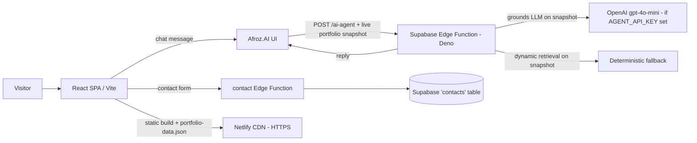

# Personal Portfolio — Kazi Afroz Alam

A single-page, terminal‑inspired developer portfolio for **Kazi Afroz Alam**, Backend AI Engineer. It showcases experience, projects, skills, education, publications, and a live **AI agent (Afroz.AI)** grounded on the resume data.

> Built with React + TypeScript (Vite), Tailwind CSS v4, Framer Motion, and a Supabase Edge Function (Deno) powering the AI agent.

---

## Assignment — "Open It on Your Phone" (Week 6 · General AI Fluency)

**Goal:** make the portfolio genuinely work on a real phone (and tablet/desktop), fix readability/contrast, verify every link, and keep a fix log.

**Method:** I audited the site with AI ("what's broken on mobile, what's the accessibility problem, why is this slow?") plus manual checks at **375px / 768px / 1280px**, then fixed each finding and verified with a Playwright smoke suite (9/9 passing on both mobile and desktop).

### Fix Log

| # | Problem (before) | Fix (after) | Evidence |
|---|---|---|---|
| 1 | **Mobile navigation was broken** — the hamburger menu scrolled away / its links were unreachable on phones. | Rebuilt `Nav` with a real toggle: `aria-expanded` + `aria-controls`, closes on link click and `Escape`, panel stays inside the fixed header. | `fix-log/before-mobile.png` vs `fix-log/after-mobile.png` |
| 2 | **AI agent input/send unreachable on small screens** — the chat input + send button could be pushed out of view. | Chat is a single column on mobile; full-width labeled input (`aria-label`) + send button (`aria-label="Send message"`) always reachable. | `fix-log/after-mobile.png` |
| 3 | **No skip link / no main landmark** — keyboard & screen-reader users had no quick way past the nav. | Added a "Skip to content" link (visible on focus) and `id="main"` on `<main>`. | smoke: "skip link is keyboard reachable" |
| 4 | **No visible focus indicator** — keyboard focus was invisible. | Global `:focus-visible` accent outline on all interactive elements. | `src/theme.css` |
| 5 | **Reduced-motion ignored** — animations kept running for users who asked to reduce motion. | Full `prefers-reduced-motion` CSS block + `<MotionConfig reducedMotion="user">`. | `src/theme.css`, `src/main.tsx` |
| 6 | **Async feedback not announced** — chat replies / form errors / success weren't read by screen readers. | `aria-live="polite"` on chat, `role="status"` + sr-only "Agent is typing…", `role="alert"` on form errors, `role="status"` on success. | `AIAgent.tsx`, `Contact.tsx` |
| 7 | **Form not accessible** — inputs lacked `aria-invalid`/`aria-describedby`; submit was clickable while empty. | Wired `aria-invalid` + `aria-describedby`; submit disabled until name/email/message are filled; added `autocomplete`. | smoke: "contact form enables submit when filled" |
| 8 | **Small touch targets** — hamburger + social icons were 40px. | Bumped to 44px (WCAG 2.5.5 target size). | `src/components/Nav.tsx` |
| 9 | **Section landmarks missing** — sections weren't labeled regions; heading order unverified. | Each `Section` is `role="region"` with `aria-labelledby`; verified heading order h1→h2→h3 (no skips). | `src/components/ui/Section.tsx` |
| 10 | **Possible overflow / blurry images** — checked. No horizontal overflow (body uses `overflow-x: clip`). Project visuals are vector (SVG/CSS), so they stay crisp at every width; no raster images to compress. | Confirmed no overflow at 375/768/1280; no raster assets. | `fix-log/overflow.mjs` + `fix-log/after-*.png` |

### Verification (maps to the pass/revise rubric)

- ✅ **Works on mobile** — hamburger menu, AI chat, and contact form are all reachable at 375px (screenshots + Playwright smoke suite, 9/9 on mobile *and* desktop).
- ✅ **Readable & crisp** — comfortable text sizes and line spacing; project visuals are SVG/CSS (no blurry raster); no horizontal overflow at any width.
- ✅ **Contrast** — primary text/accents on `#080808` meet WCAG AA; the dim gray `#8a8a8a` is used only for secondary monospace labels.
- ✅ **Links** — nav, footer, social (GitHub / LinkedIn / Resume), and every project's repo + demo link resolve; the smoke test asserts the GitHub/LinkedIn/Resume destinations.
- ✅ **Nothing obviously broken** at 375 / 768 / 1280 (see `fix-log/*.png`).

### Screenshots

- **Before** (live, previous build): `fix-log/before-mobile.png`, `fix-log/before-tablet.png`, `fix-log/before-desktop.png`
- **After** (this build): `fix-log/after-mobile.png`, `fix-log/after-tablet.png`, `fix-log/after-desktop.png`

### Deliverables

- **Live URL:** `https://kaziafrozalam.netlify.app` (re-deploy with these fixes — see [Deployment](#deployment)).
- **Fix log:** this section.

---

## Portfolio Critique ("Survive the Crit")

A recruiter-style re-review of this portfolio lives in [`Survive-the-Crit-Report.md`](./Survive-the-Crit-Report.md). The second pass scores the site **9/10** and calls it *"hireable, unambiguously"* — the six original must-fix issues (empty Future Work, an unverifiable headline metric, missing book-a-call CTA, generic hero boilerplate, links not opening in a new tab, vague FlyRank copy) are all resolved in code. The only remaining notes are a single "Details coming soon" Future Work card and a suggested deep-dive case study on CHECKMATE.

---

## Site Metadata, Analytics & FlyRank Badge

### Google Analytics (GA4)
The site uses Google Analytics 4, loaded via gtag.js in `index.html`:
- Measurement ID: **`G-VRV8G38DDF`**
- Snippet lives in `<head>` (async loader + `gtag('config', 'G-VRV8G38DDF')`).

### SEO & social-share metadata
`index.html` carries production-ready metadata so the share preview, favicon, and
page title are correct on the live address:
- `<title>` + `<meta name="description">` and a `canonical` link
- **Open Graph:** `og:type`, `og:site_name`, `og:title`, `og:description`, `og:url`,
  and `og:image` → `https://kaziafrozalam.netlify.app/og-image.png`
- **Twitter:** `twitter:card=summary_large_image`, `twitter:title`,
  `twitter:description`, `twitter:image`
- **Favicon:** `/favicon.svg` (matches the dark `#080808` theme)

> `public/og-image.png` is copied to `dist/` on build. If you move to a custom
> domain, update `canonical`, `og:url`, and the `og:image` / `twitter:image` base
> URLs in `index.html`.

### FlyRank Graduate Badge
The footer (`src/components/Footer.tsx`) renders the official **dark** FlyRank
Graduate Badge (compact pill). It links to the verification page and opens in a
new tab:
- `href`: `https://internship.flyrank.ai/verify?id=FR-D1-T668H-R789R&first_name=Kazi%20Afroz`
- `target="_blank"`, `rel="noopener noreferrer"`
- `aria-label`: `Verify Kazi Afroz Alam's FlyRank AI Internship credential FR-D1-T668H-R789R`
- Credential ID shown on the badge: `FR-D1-T668H-R789R`

The badge is the official asset from `https://internship-badge.netlify.app/`
(dark variant). Do not restyle it; replace the JSX if FlyRank updates the asset.

---

## Features

- **Sections** — Hero (with a **BOOK A CALL** CTA), About, Experience (incl. FlyRank AI), Projects (9 projects), Skills, Metrics, Education, Publications, a fully-developed **Future Work** roadmap (six workstreams: Capstone, Experiments, Research Projects, Field Notes, Applied AI Systems, Learning Queue), an interactive **AI Agent**, and a Contact form.
- **AI Agent (Afroz.AI)** — answers **any** question about the portfolio (projects, skills, experience, publications, certifications, future work, field notes, and site docs like a **DNS walkthrough** / **README overview**). It is a Supabase Edge Function that is **fully portfolio-driven**: the browser sends the live `src/data/portfolio.ts` snapshot as grounding context, so there is no hardcoded knowledge base. An optional LLM mode gives natural-language answers; a local deterministic retriever is the fallback. Out-of-scope questions are answered with *"That information isn't available in the portfolio."*
- **Contact form** — submitted to a Supabase Edge Function that persists entries to a `contacts` table.
- **Responsive, accessible + animated** — Framer Motion transitions, monospace/terminal aesthetic, fully responsive layout, skip link, visible focus, and reduced-motion support.

## Architecture



The portfolio (`src/data/portfolio.ts`) is the **single source of truth**. The browser serializes it into a snapshot and sends it with every agent request, so the edge function never stores a stale copy of the data. On each build, `scripts/build-portfolio-data.mjs` also writes `public/portfolio-data.json`; the edge function can fetch that (via `PORTFOLIO_DATA_URL`) to self-sync on direct calls. Updating `portfolio.ts` and redeploying the site is all that's needed to update the agent — no function redeploy or KB edit required.

## Tech Stack

| Layer          | Technology                                                       |
| -------------- | ---------------------------------------------------------------- |
| Framework      | React 18 + TypeScript, Vite 5                                    |
| Styling        | Tailwind CSS v4 (via `@tailwindcss/vite`)                        |
| Animation      | Framer Motion (`motion`)                                         |
| Icons          | `lucide-react`                                                   |
| Routing        | `react-router` (v7)                                              |
| Backend/AI     | Supabase Edge Functions (Deno), `@supabase/supabase-js`          |
| Optional LLM   | OpenAI `gpt-4o-mini` (only if `AGENT_API_KEY` is set)            |

## Project Structure

```text
.
├─ index.html
├─ vite.config.ts
├─ tailwind / postcss (Tailwind v4 via Vite plugin)
├─ scripts/
│  └─ build-portfolio-data.mjs  # serializes portfolio.ts -> public/portfolio-data.json (agent auto-sync)
├─ public/
│  └─ portfolio-data.json       # generated; live portfolio snapshot for the edge function
├─ src/
│  ├─ data/portfolio.ts        # All site content (single source of truth)
│  ├─ sections/                # Page sections (Hero, Experience, Projects, AIAgent, ...)
│  ├─ components/              # Reusable UI (Nav, Footer, ProjectVisual, ...)
│  ├─ context/                # Scroll-index context
│  ├─ hooks/                  # use-section-index
│  ├─ lib/                    # helpers (incl. portfolioContext.ts — flattens portfolio into agent context)
│  └─ integrations/supabase/  # Supabase client
└─ supabase/
   ├─ config.toml
   ├─ functions/
   │  ├─ ai-agent/index.ts    # AI agent edge function (Deno)
   │  ├─ contact/index.ts     # Contact form handler (Deno)
   │  └─ _shared/logger.ts
   └─ migrations/
```

## Prerequisites

- **Node.js** ≥ 18
- **npm**
- A **Supabase** project (free tier is fine) — needed for the AI agent and contact form
- *(Optional)* **Supabase CLI** for local dev / function deployment

## Environment Variables

Copy `.env.example` to `.env` (project root) and fill in your values:

```bash
# Public (browser) — used by the Supabase JS client
VITE_SUPABASE_URL=https://<your-project-ref>.supabase.co
VITE_SUPABASE_ANON_KEY=<your-anon-key>
# VITE_SUPABASE_PUBLISHABLE_KEY is an alias for the anon key in newer setups
VITE_SUPABASE_PUBLISHABLE_KEY=<your-anon-key>

# Server-side (edge functions only) — NEVER expose these to the browser
SUPABASE_URL=https://<your-project-ref>.supabase.co
SUPABASE_SERVICE_ROLE_KEY=<your-service-role-key>
SUPABASE_DB_PASSWORD=<your-db-password>

# Optional — enables LLM mode in the ai-agent function (OpenAI)
AGENT_API_KEY=<your-openai-key>

# Optional — URL of the deployed site's portfolio-data.json, used by the
# ai-agent function to self-sync on direct calls (the site regenerates this
# file on every build). If unset, the function relies on the snapshot sent
# by the browser with each request.
PORTFOLIO_DATA_URL=https://<your-site>/portfolio-data.json
```

> The `service_role` key bypasses RLS and must stay server‑side only.

## Local Development

```bash
# 1. Install dependencies
npm install

# 2. Start the dev server (http://localhost:5173)
npm run dev

# 3. Type-check (no emit)
npm run typecheck

# 4. Production build -> dist/
npm run build

# 5. Preview the production build
npm run preview
```

## Supabase Setup

### 1. Link the project (optional for local CLI use)

```bash
npx supabase login
npx supabase link --project-ref <your-project-ref>
```

### 2. Deploy the Edge Functions

```bash
# AI agent
npx supabase functions deploy ai-agent --no-verify-jwt

# Contact form handler
npx supabase functions deploy contact --no-verify-jwt
```

### 3. Set secrets (server-side, used inside the functions)

```bash
npx supabase secrets set SUPABASE_URL=https://<ref>.supabase.co
npx supabase secrets set SUPABASE_SERVICE_ROLE_KEY=<service-role-key>
# Optional LLM mode:
npx supabase secrets set AGENT_API_KEY=<openai-key>
```

### 4. Apply the database schema (for the contact form)

The repo ships a migration at `supabase/migrations/0001_init.sql` that creates the
`contacts` table (along with `agent_logs`, `page_views`, `edge_logs`) **with Row
Level Security and an `anon insert contacts` policy**. Apply it with the CLI:

```bash
npx supabase db push        # pushes local migrations to the linked project
# or, for finer control:
npx supabase migration up
```

The `contact` Edge Function writes with the **service-role key** (which bypasses
RLS), so the table only needs to exist with `name`, `email`, `message` (and
optionally `source`, `created_at`). If you run the SQL by hand instead of the
migration, use the exact schema from `supabase/migrations/0001_init.sql`:

```sql
create table if not exists public.contacts (
  id         uuid primary key default gen_random_uuid(),
  name       text not null,
  email      text not null,
  message    text not null,
  source     text not null default 'website',
  created_at timestamptz not null default now()
);
```

## How the AI Agent Works

- **Single source of truth** — `src/data/portfolio.ts` is the only knowledge base. The browser serializes it into a snapshot and sends it as `context` with every request to the edge function.
- **Primary path** — the browser calls the deployed `ai-agent` Supabase Edge Function with the live portfolio snapshot.
- **LLM mode (optional)** — if `AGENT_API_KEY` is set, the function grounds OpenAI `gpt-4o-mini` strictly on the portfolio snapshot via a system prompt. It may answer **any** portfolio question (projects, skills, experience, publications, certifications, future work, field notes, and site docs such as a DNS walkthrough / README overview). For anything **not** in the portfolio it replies exactly: *"That information isn't available in the portfolio."* — it never invents details.
- **Fallback** — if the function isn't deployed, errors, or has no LLM key, the app uses a built‑in deterministic retriever (`src/sections/AIAgent.tsx`) that scores the query against the same live portfolio snapshot and returns the most relevant content. The chat always works and always stays on-portfolio.
- **Auto-sync** — because the client sends the current snapshot on every request and `npm run build` regenerates `public/portfolio-data.json`, updating `portfolio.ts` and redeploying the site updates the agent automatically. No manual KB or prompt edits, and no edge-function redeploy, are needed for content changes.

**Suggested queries** (shown in the UI as examples only — the user can ask anything) include skills, FlyRank work, ML models, RAG, current learning, publications, *“How does DNS work?”*, and *“Can you show the project README / overview?”*.

## Deployment

### Frontend (static)

`npm run build` outputs `dist/`. Deploy it to any static host (Vercel, Netlify, Cloudflare Pages, GitHub Pages, etc.). Set the same `VITE_SUPABASE_*` env vars in the host's build settings.

**Netlify (one command):** `netlify.toml` is included (build = `npm run build`, publish = `dist`, SPA fallback). Run `npm run deploy` (builds and publishes `dist/`; first run opens a browser to authenticate), or drag-and-drop the `dist/` folder in the Netlify deploys UI.

### Functions

Deploy with the `supabase functions deploy` commands above. Ensure the function secrets are set in the Supabase dashboard or via the CLI.

## Customizing Content

All copy, projects, experience, skills, publications, future work, and the AI agent's grounding all live in **`src/data/portfolio.ts`**.
Edit that one file to update the site **and** the AI agent at the same time — the agent reads the new content automatically on the next deploy. You do **not** need to edit prompts, knowledge bases, or redeploy the `ai-agent` function for content changes (only `npm run build` + a site deploy, which also regenerates `public/portfolio-data.json`).

## Scripts

| Command            | Description                                     |
| ------------------ | ----------------------------------------------- |
| `npm run dev`      | Start the Vite dev server                       |
| `npm run build`    | Production build to `dist/`                     |
| `npm run preview`  | Preview the production build                    |
| `npm run typecheck`| Run `tsc --noEmit`                              |
| `npm run test:e2e` | Run Playwright smoke tests (`BASE_URL` overrides target) |
| `npm run deploy`   | Build + publish `dist/` to Netlify              |

## Notes

- Supabase Edge Functions run on **Deno**; the `supabase/functions/tsconfig.json` + `deno-env.d.ts` provide editor type‑checking for `Deno.*` globals without affecting the app build.
- The site is styled with **Tailwind CSS v4**, configured through the Vite plugin (no `tailwind.config.js` required).

## Design Decisions

- **Single source of truth (`src/data/portfolio.ts`).** All copy, projects, and the agent's grounding derive from one file, and the browser sends that file's snapshot to the edge function on every request. *Trade-off:* the edge function previously duplicated the data; now it receives the live snapshot (and can fetch `public/portfolio-data.json`), so edits never require a function redeploy to stay in sync.
- **Portfolio-grounded LLM + dynamic fallback.** The edge function grounds OpenAI `gpt-4o-mini` on the live snapshot when `AGENT_API_KEY` is set, and a deterministic retriever over the same snapshot is the always-available fallback (`src/sections/AIAgent.tsx`). *Why:* the chat always works, never hardcodes answers, and can't drift from the portfolio. *Trade-off:* without an LLM key the fallback is retrieval-based (returns the most relevant portfolio excerpt) rather than conversational.
- **Server-side API-key handling.** The LLM key lives only in the edge function's environment, never the browser. *Why:* prevents secret leakage.
- **Static SPA on Netlify.** Simple, free, HTTPS-by-default hosting with a SPA fallback (`netlify.toml`). *Why:* minimal ops for a portfolio.
- **Launch hygiene baked in.** GA4, Open Graph/Twitter metadata, `og-image.png`, favicon, and the official FlyRank Graduate Badge were added so the site is shareable and verifiable.

## Evaluation

| Evaluation | Result | Source |
| --------- | -----: | ------ |
| Recruiter design re-review (V2) | **9 / 10** | `Survive-the-Crit-Report.md` |
| UI smoke tests (mobile + desktop) | **9 / 9 passing** | `e2e/smoke.spec.ts` |
| Quantitative benchmarks (latency / accuracy / RAG eval) | not in repo | — |

> V2 quantitative evaluation data (benchmarks, accuracy, latency) is not currently available in the repository and must be supplied before submission if required.

The re-review confirms the six original must-fix issues (empty Future Work, an unverifiable headline metric, missing book-a-call CTA, generic hero boilerplate, links not opening in a new tab, vague FlyRank copy) are all resolved in code. The Playwright suite asserts the hamburger menu, AI chat input/send, and contact form are reachable and functional at 375px and 1280px.

## Limitations

1. **Functional** — The AI agent answers any question that the **portfolio** covers (projects, skills, experience, publications, certifications, future work, field notes, site docs). Questions outside that scope intentionally return *"That information isn't available in the portfolio."* rather than a guess. The "RAG" work described in the content refers to a separate FlyRank backend project, not this repo.
2. **AI/ML** — LLM mode depends on an external OpenAI key (`AGENT_API_KEY`); without it, the deterministic retriever fallback is used (returns the most relevant portfolio excerpt rather than a conversational answer). When LLM mode is active, a strict system prompt prevents it from inventing details not present in the portfolio snapshot.
3. **Data** — Content is static; the agent has no live data source.
4. **Scalability** — Edge functions have cold starts; the agent has open CORS (`*`) and no rate limiting.
5. **Reliability** — If Supabase is unreachable, the agent degrades to the client fallback (acceptable) but the contact form cannot submit.
6. **Security/privacy** — The contact form stores visitor PII (email/message) in Supabase; the anon-insert policy relies on the service-role key server-side. Handle PII per your privacy posture.
7. **Deployment** — Full AI + contact features require a Supabase project and deployed functions + env secrets; the static site itself works without them.

## Known Failure Cases

- Off-topic or out-of-portfolio questions return *"That information isn't available in the portfolio."* (by design). Severely typo'd in-scope queries may match the wrong portfolio excerpt in the no-LLM fallback.
- Contact submission fails (surfaced via `role="alert"`) if Supabase secrets/functions are not deployed.
- A social platform may cache an old `og:image`; re-scrape to refresh the preview.

## AI-Assisted Development Transparency

AI coding assistants were used during development to accelerate implementation, documentation, accessibility/responsive fixes, and QA (including this README and the Week 8 submission package). The portfolio content, FlyRank internship work, agent grounding design, and all deployments were authored/verified by Kazi Afroz Alam. Generated code was validated via `npm run build`, `npm run typecheck`, the Playwright smoke suite, and live deploy checks — not shipped blindly.


## License

Personal portfolio. All rights reserved © 2026 Kazi Afroz Alam.
